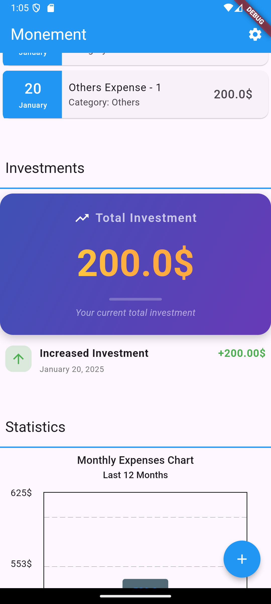

# Money Management Application - Monement

## Overview
The **Money Management Application** is a powerful and intuitive tool designed to help users track their daily expenses and manage their investments. It provides a clean and user-friendly interface with real-time updates, customizable categories, and insightful visualizations to better understand spending habits and investment growth.

---

## Features

### Expense Management
- **Add Expenses**: Quickly add expenses with fields for name, description, amount, category, and date.
- **Categorization**: Assign expenses to pre-defined or custom categories.
- **Dynamic Lists**: Display expense items with smooth animations when adding or removing items.
- **Validation**: Ensure inputs are correct with validation rules for text and numeric fields.

### Investment Tracking
- **Total Investment Display**: Shows the total investment amount prominently in a modern and visually appealing design.
- **Investment Updates**: Log increases or decreases in investments with corresponding descriptions and timestamps.
- **Real-Time Updates**: Ensure the displayed data reflects the latest changes immediately.

### Custom Categories
- **Customizable Categories**: Create, edit, and delete expense or investment categories.
- **Persistent Storage**: Store categories locally using Hive for long-term usage.

### UI/UX Enhancements
- **Responsive Design**: Adapts to different screen sizes and orientations.
- **Persistent Widgets**: Includes floating buttons or widgets that remain fixed on the screen during scrolling.
- **Animations**: Leverages Flutter’s animation capabilities for smoother transitions.

### Notifications
- **Snackbars**: Notify users of successful actions (e.g., “Expense Created”) or errors.
- **Dialogues and Bottom Sheets**: Provide intuitive interfaces for actions like adding categories or investments.

---

## Installation

### Prerequisites
1. [Flutter SDK](https://flutter.dev/docs/get-started/install)
2. [Dart SDK](https://dart.dev/get-dart)
3. Code editor like [Visual Studio Code](https://code.visualstudio.com/) or [Android Studio](https://developer.android.com/studio)

### Steps
1. Clone the repository:
   ```bash
   git clone https://github.com/your-repo/money-management-app.git
   ```

2. Navigate to the project directory:
   ```bash
   cd money-management-app
   ```

3. Install dependencies:
   ```bash
   flutter pub get
   ```

4. Run the app:
   ```bash
   flutter run
   ```

---

## Project Structure

```
lib/
├── main.dart          # Entry point of the application
├── model/            # Data models (e.g., ExpenseItem, InvestmentItem)
├── page/           # Screens for different views (e.g., AddExpense, Dashboard)
├── components/           # Reusable UI components (e.g., cards, buttons)
├── utils/             # Utility functions and constants (e.g., date formatting, themes)
├── database/          # Database configuration and operations
└── hive_configuration.dart
```

---

## Customization

### Adding Colors to the Theme
1. Open the `utils/theme.dart` file.
2. Add your custom colors to the `ThemeData` configuration.
   ```dart
   primarySwatch: Colors.blue,
   secondaryHeaderColor: Colors.green,
   ```

---

## Dependencies

| Package               | Version |
|-----------------------|---------|
| flutter               | ^3.0.0  |
| hive                  | ^2.2.3  |
| get                   | ^4.6.5  |
| form_builder_validators | ^8.1.0 |

---

## Contribution

1. Fork the repository.
2. Create a new branch:
   ```bash
   git checkout -b feature-name
   ```
3. Commit your changes:
   ```bash
   git commit -m "Description of changes"
   ```
4. Push to the branch:
   ```bash
   git push origin feature-name
   ```
5. Create a pull request on GitHub.

---

## License
This project is licensed under the MIT License. See the LICENSE file for details.

---

## Screenshots

### Homepage


### Investments


### Statistics


### Create Expense


### Detail Expense

---
